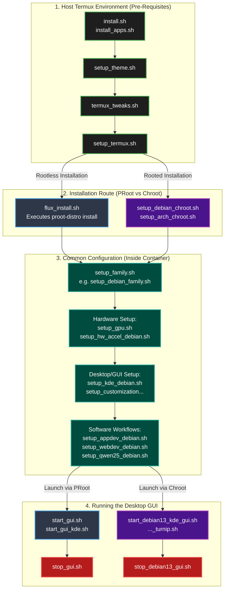

# FluxLinux Script Execution Flowchart

This flowchart visualizes the lifecycle of a FluxLinux installation, mapping out how scripts are executed chronologically and which environments they belong to.

### Flow Breakdown:
1. **Host Termux Environment (Green):** The FluxLinux Android app first writes scripts to the Termux environment. It runs `install.sh` to get basic packages, applies terminal tweaks, and finalizes with `setup_termux.sh` to allow storage access and install `proot-distro`.
2. **Installation Route (Blue & Purple):** The user chooses an installation method. PRoot (Rootless) relies on `flux_install.sh` to spawn the container, whereas Chroot (Rooted) uses `setup_debian_chroot.sh` to natively mount the filesystem.
3. **Common Configuration (Teal):** Once the container (PRoot or Chroot) is active, it runs identical scripts! Both routes execute the exact same `setup_debian_family.sh`, hardware setups, and software workflow installations to ensure a consistent experience regardless of whether the device is rooted or not.
4. **Running the Desktop GUI (Red):** The launch mechanism diverges again depending on the environment container. PRoot uses `start_gui.sh`, whereas Chroot natively spawns the display using `start_debian13_kde_gui.sh`.
