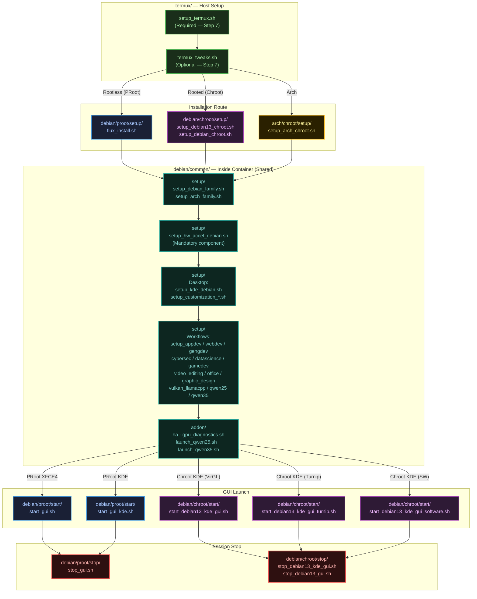

# FluxLinux Script Execution Flowchart

This flowchart visualises the lifecycle of a FluxLinux installation using the restructured `scripts/` filesystem, grouped by **distro → execution type → action**.



---

### Directory Structure Summary

```
scripts/
├── termux/                          # Host Termux — always runs first
│   ├── setup_termux.sh              # Required: PrerequisitesScreen Step 7
│   ├── termux_tweaks.sh             # Optional: PulseAudio & X11 config
│   ├── install.sh                   # Standalone bootstrap helper
│   ├── install_apps.sh              # Standalone package helper
│   └── setup_theme.sh              # Standalone terminal theming
│
├── debian/
│   ├── common/
│   │   ├── setup/                   # 21 scripts — run inside container
│   │   └── addon/                   # 5 files — runtime helpers & launchers
│   ├── proot/
│   │   ├── setup/   flux_install.sh
│   │   ├── start/   start_gui.sh · start_gui_kde.sh
│   │   └── stop/    stop_gui.sh
│   └── chroot/
│       ├── setup/   setup_debian13_chroot.sh · setup_debian_chroot.sh · uninstall_*
│       ├── start/   start_debian13_kde_gui*.sh  (3 GPU variants)
│       └── stop/    stop_debian13_*.sh
│
├── arch/
│   ├── common/setup/  setup_arch_family.sh
│   └── chroot/setup/  setup_arch_chroot.sh
│
└── fedora/
    └── common/setup/  setup_fedora_family.sh
```

### Flow Notes

1. **Host Setup (Green):** The app always runs `termux/setup_termux.sh` first (mandatory), then optionally `termux/termux_tweaks.sh`. The `install.sh`, `install_apps.sh`, and `setup_theme.sh` files are standalone helpers.

2. **Installation Routes (Blue/Purple/Yellow):** After host setup, the user selects:
   - **PRoot (Rootless):** `debian/proot/setup/flux_install.sh` pulls the container image
   - **Chroot (Rooted):** `debian/chroot/setup/setup_debian13_chroot.sh` (primary), or generic Debian/Arch variants
   - **Arch:** `arch/chroot/setup/setup_arch_chroot.sh`

3. **Common Container Scripts (Teal):** All routes converge into `debian/common/setup/` — the same scripts run inside PRoot and Chroot alike. Hardware acceleration (`setup_hw_accel_debian.sh`) is always first as a mandatory component.

4. **GUI Launch & Stop (Red):** Launch mode depends on container type + desktop choice:
   - PRoot → `debian/proot/start/start_gui.sh` (XFCE4) or `start_gui_kde.sh` (KDE)
   - Chroot → one of 3 GPU variants in `debian/chroot/start/`
   - Each has a corresponding stop script in the `stop/` sibling folder.
