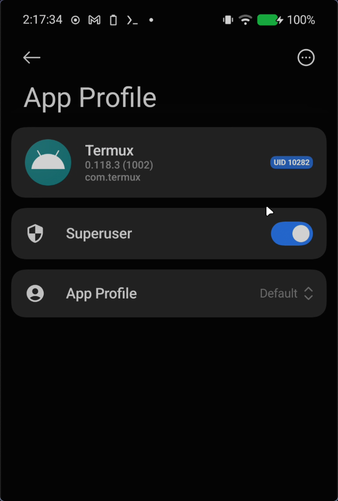
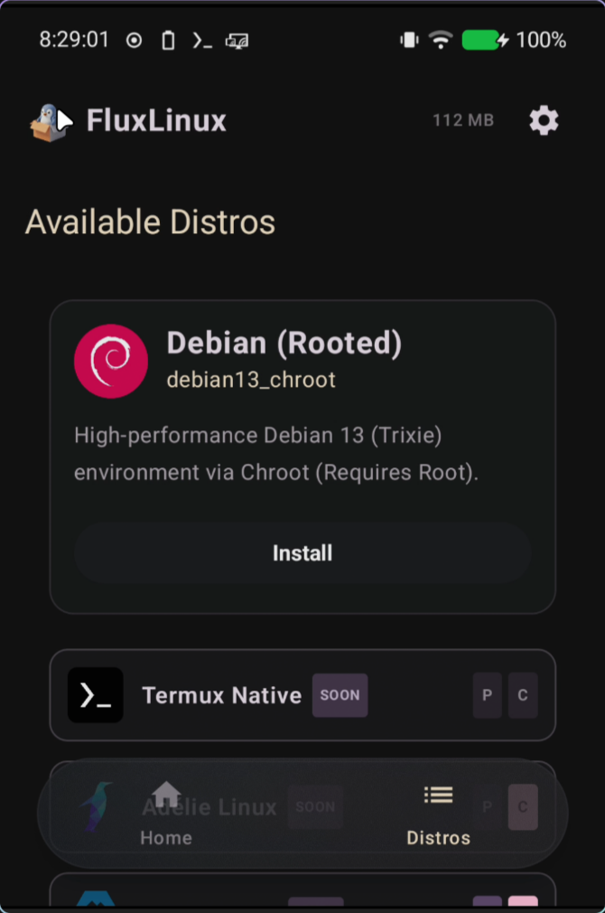
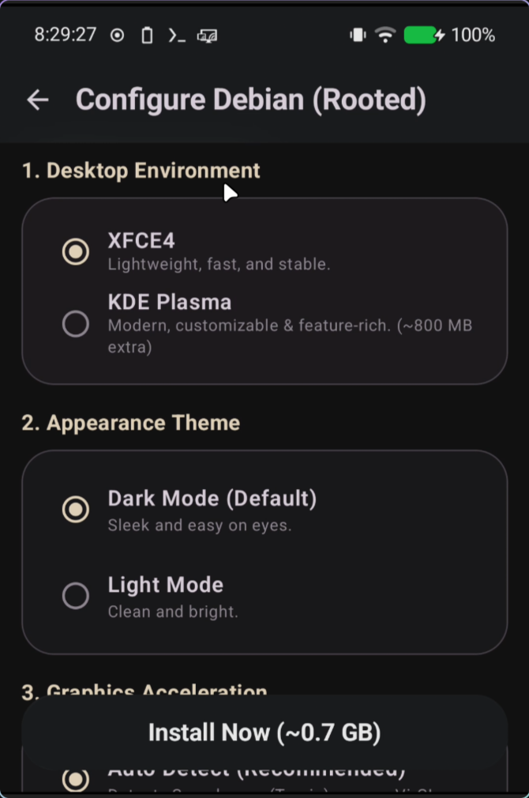
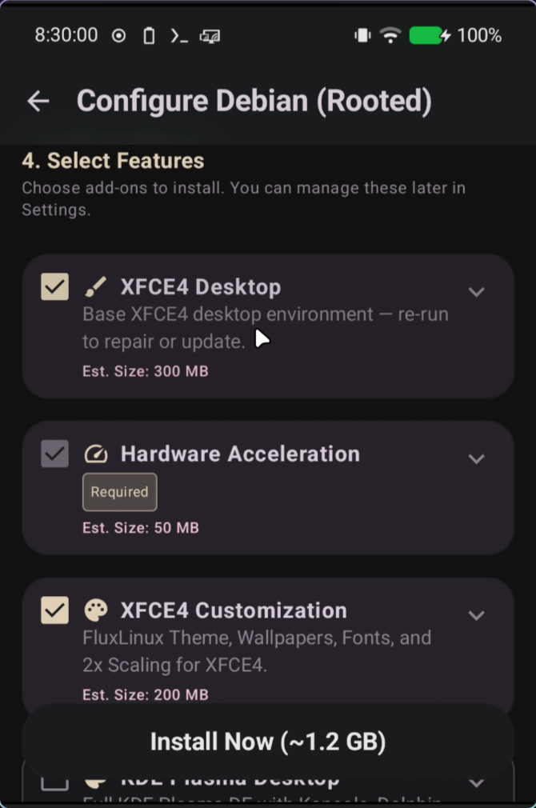
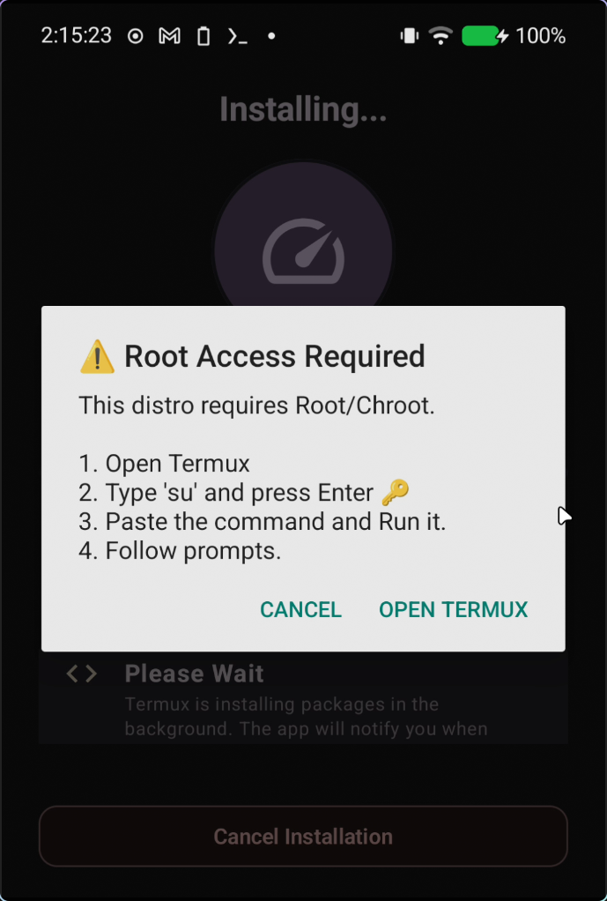
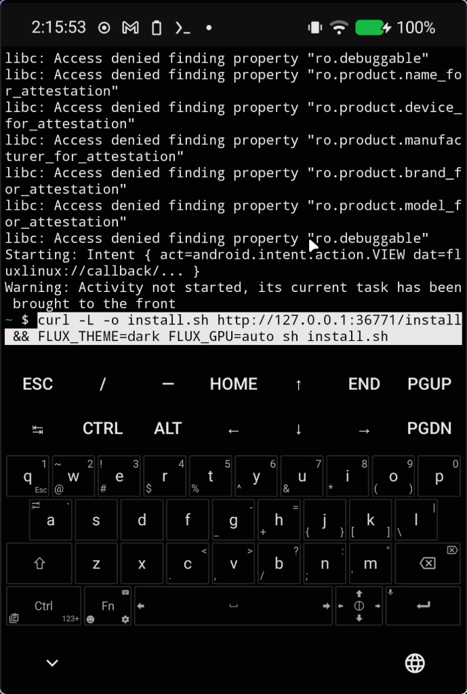
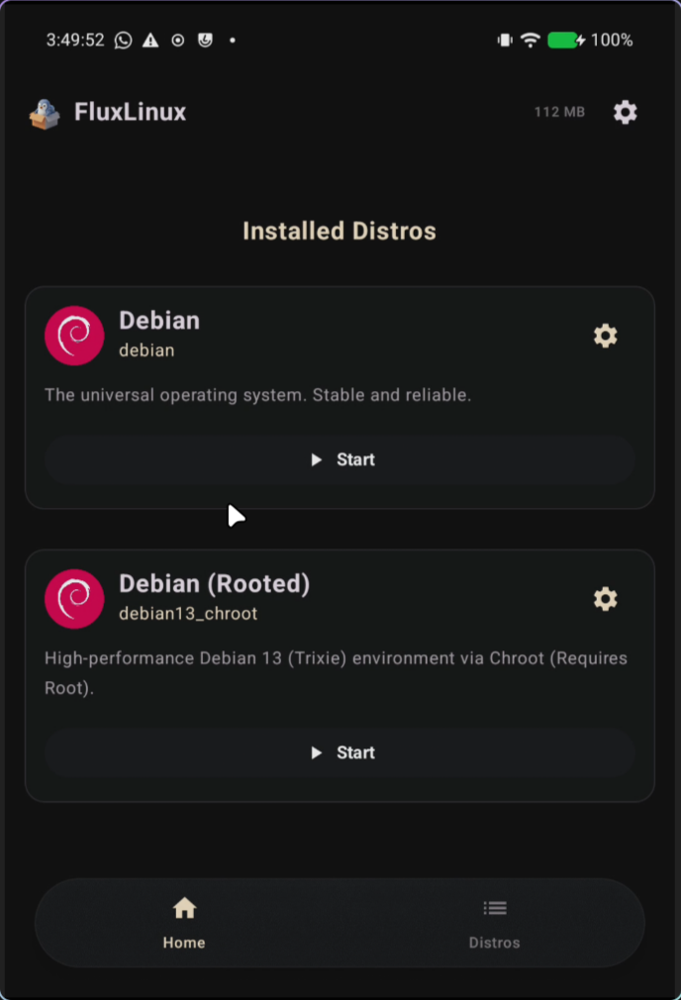
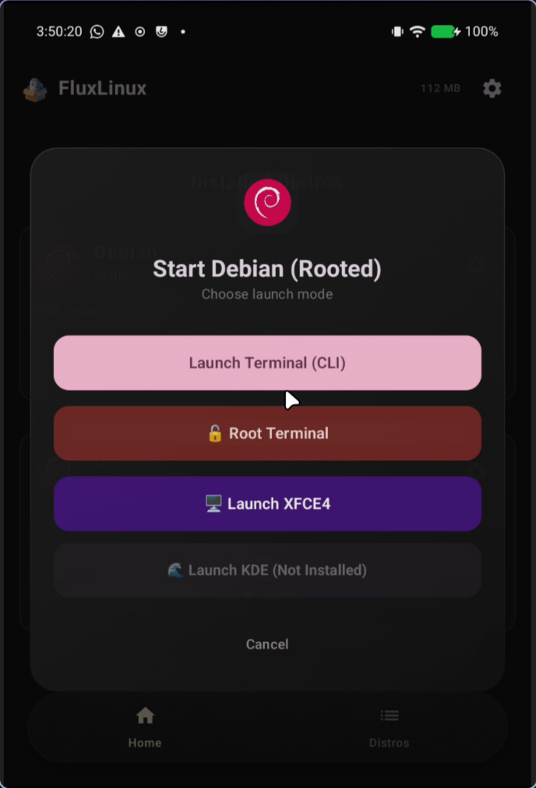

  
  <h1>🐧 Setting up Debian Chroot (Root Required)</h1>
  
This tutorial will guide you step-by-step through configuring and installing a Debian Chroot distribution on your rooted Android device using FluxLinux. Chroot mode provides near-native performance and full hardware access.

---

## 📖 Table of Contents

0. [🔑 Step 0: Grant Root Access to Termux](#-step-0-grant-root-access-to-termux)
1. [🐧 Step 1: Select Debian (Rooted) Distribution](#-step-1-select-debian-rooted-distribution)
2. [⚙️ Step 2: Configure Debian Settings](#️-step-2-configure-debian-settings)
3. [📋 Step 3: Generate and Copy the Setup Command](#-step-3-generate-and-copy-the-setup-command)
4. [⚡ Step 4: Execute the Command in Termux](#-step-4-execute-the-command-in-termux)
5. [🎉 Step 5: Verify Installation in Home Screen](#-step-5-verify-installation-in-home-screen)
6. [🛑 Step 6: Controlling the Session](#-step-6-controlling-the-session)
7. [💡 Important Tips & Troubleshooting](#-important-tips--troubleshooting)

---

## 🔑 Step 0: Grant Root Access to Termux

Before starting the installation, you must ensure that Termux has root access permissions granted by your superuser manager (e.g., Magisk or KernelSU).

1. Open Termux.
2. Type `su` and press **Enter**.
3. When prompted by your root manager, grant root access permanently.

| Action / State | Screenshot | Description |
| :--- | :---: | :--- |
| **Grant Root Access** |  | Grant superuser (root) permissions to Termux to allow the Chroot container to run natively on your Android system. |

---

## 🐧 Step 1: Select Debian (Rooted) Distribution

Launch the FluxLinux app and navigate to the **Distributions** tab. Here you will see a list of available Linux distributions.

1. Select the **Debian (Rooted)** option.
2. Tap on it to open its configuration and installation settings.

| Action / State | Screenshot | Description |
| :--- | :---: | :--- |
| **Select Debian (Rooted)** |  | Select the **Debian (Rooted)** distribution specifically built for Chroot environments. |

---

## ⚙️ Step 2: Configure Debian Settings

Before generating the installation commands, configure your container profile.

> [!NOTE]
> Chroot provides native performance but requires your device to be rooted. Configure your desktop environment and GPU settings according to your device's capabilities.

1. **Select Mode:** Choose **Chroot** (requires root).
2. **CPU Architecture:** Select your device architecture.
3. **Desktop Environment:** Select your preferred desktop (e.g., XFCE4 or KDE Plasma).
4. **User Configurations:** Define a custom **User Name** and **Password**.
5. **Hardware Acceleration:** Configure GPU/hardware rendering (e.g., Turnip + Zink for Adreno GPUs).

| Action / State | Screenshot | Description |
| :--- | :---: | :--- |
| **Configure Distro (Part 1)** |  | Select the mode, desktop environment, and basic user settings. |
| **Configure Distro (Part 2)** |  | Configure GPU hardware acceleration and any extra custom modules. |

---

## 📋 Step 3: Generate and Copy the Setup Command

Once you finish setting up your preferences, FluxLinux will compile a customized bootstrap script.

1. Tap on the **Generate Setup Command** button.
2. Review the generated script and options.
3. Tap **Copy and Open Termux** to copy the command and automatically launch Termux.

| Action / State | Screenshot | Description |
| :--- | :---: | :--- |
| **Copy Setup Command** |  | Review the script and tap **Copy and Open Termux** to proceed. |

---

## ⚡ Step 4: Execute the Command in Termux

Once Termux opens, run the bootstrap command to compile the Debian container.

1. Long-press in the Termux terminal window and select **Paste**.
2. Press **Enter** on your keyboard to execute the bootstrap command.
3. Since this is a Chroot installation, Termux will use root privileges (`su -c`) to mount native filesystems, extract the rootfs, and set up the desktop.

| Action / State | Screenshot | Description |
| :--- | :---: | :--- |
| **Execute Command** |  | Paste the bootstrap command into Termux and execute it. Termux will handle the rest. |

---

## 🎉 Step 5: Verify Installation in Home Screen

Once the installation finishes, return to the FluxLinux app. The home screen will now list your newly installed Debian (Rooted) Chroot environment.

| Action / State | Screenshot | Description |
| :--- | :---: | :--- |
| **Verify Installation** |  | Your new Debian Chroot installation will be visible on the FluxLinux Home screen. |

---

## 🛑 Step 6: Controlling the Session

You can launch and manage your Debian Chroot session directly from the Home screen.

- **Start Session**: Launch into CLI or GUI mode.
- **Open X11**: Access the graphical display window if it was minimized.
- **Stop Session**: Safely shut down all background Debian processes and unmount native filesystems.

| Action / State | Screenshot | Description |
| :--- | :---: | :--- |
| **Chroot Controls** |  | Manage the running container session to stop it or reopen the display. |

---

## 💡 Important Tips & Troubleshooting

### ⚡ PRoot vs Chroot Mode
* **PRoot Mode:** Runs entirely in user-space and requires **no root permissions**, simulating root actions through system call interception. Performance is slightly lower.
* **Chroot Mode:** Used in this guide. Requires root permissions. It provides **near-native performance** and full hardware access by directly utilizing the Linux kernel capabilities of your Android device.

### 🛡️ Root Access Issues
* If the installation fails immediately in Termux, verify that you ran `su` at least once before to grant root permissions to Termux via Magisk or KernelSU.
* Check your superuser app to ensure Termux has persistent root permissions without a timeout.

### 🏎️ Troubleshooting Hardware Acceleration (GPU)
* Because Chroot runs natively, GPU access is more direct than in PRoot.
* Ensure you select the correct driver (e.g., Turnip + Zink for Adreno, or Panfrost for Mali) that matches your device SoC.
* If your graphical environment fails to start, fallback to **None / Software Rendering** to diagnose the issue.
