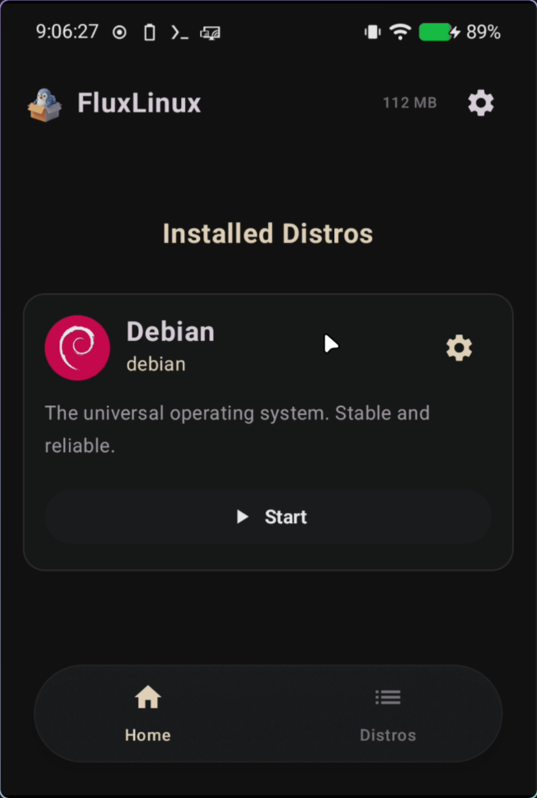
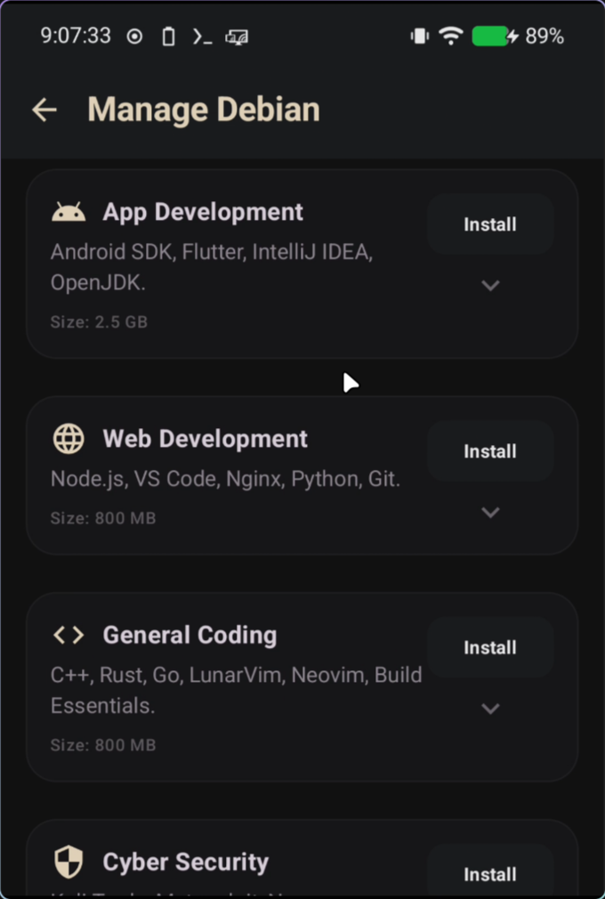
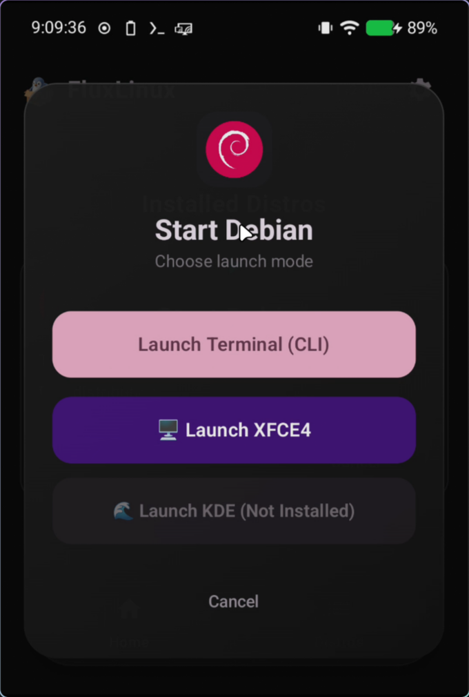
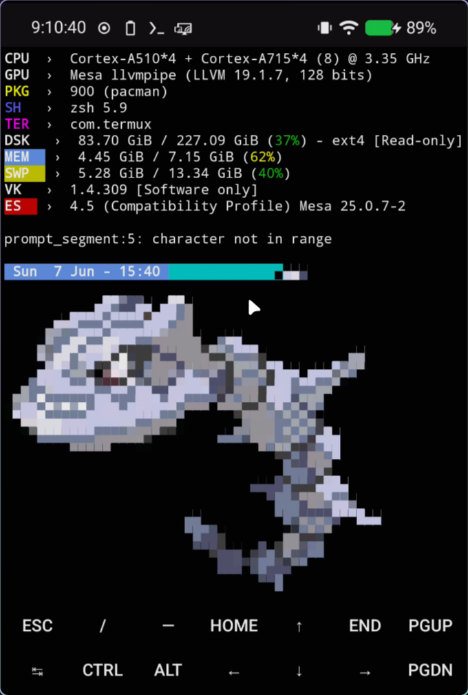
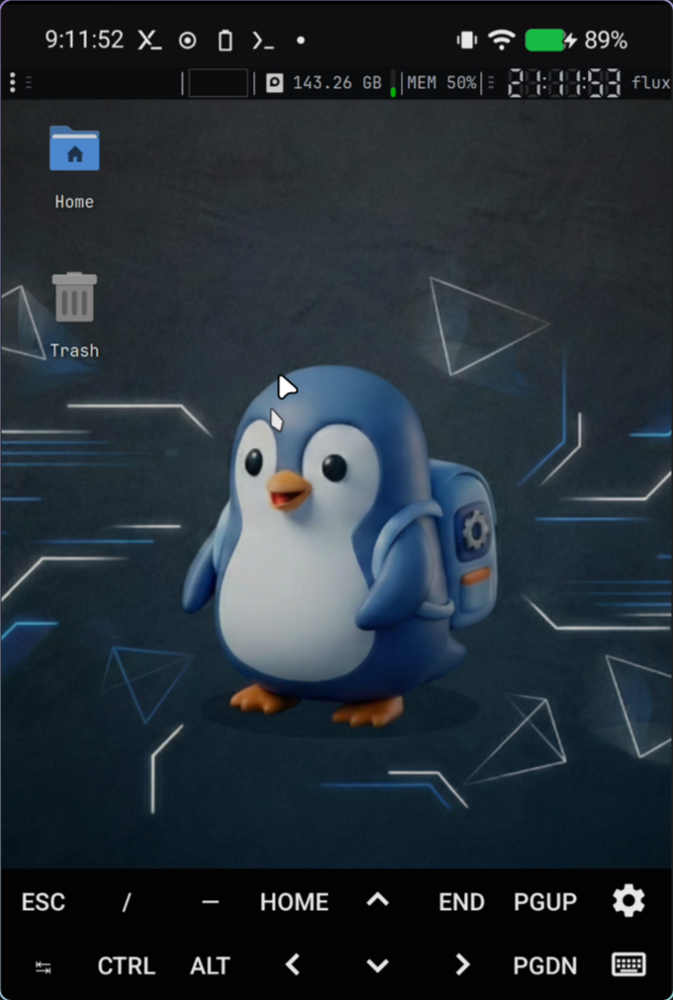
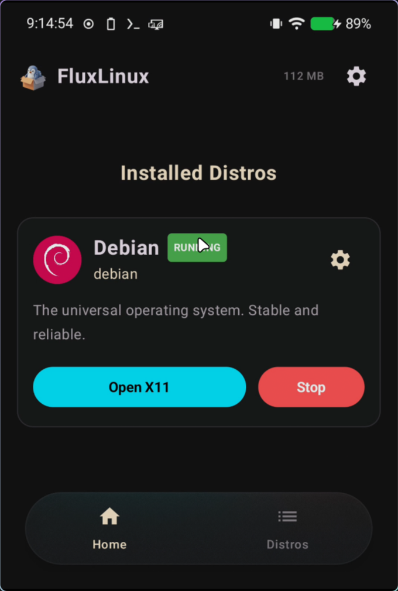
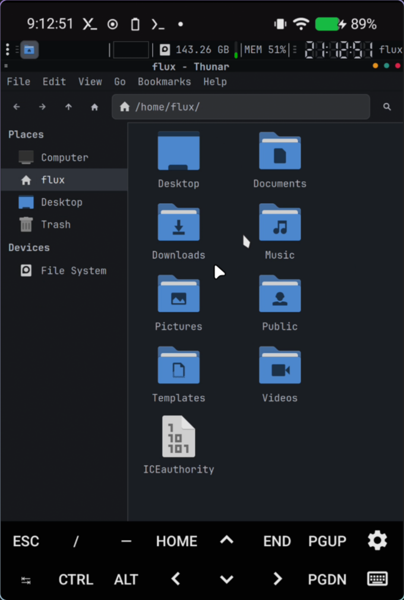
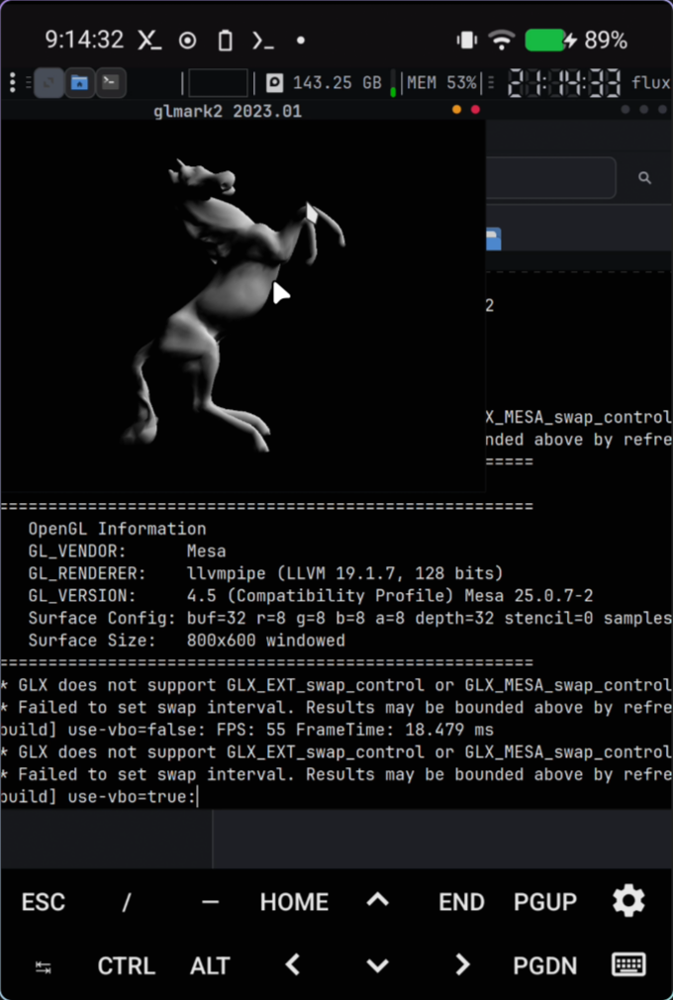

  
  <h1>🐧 Setting up Debian PRoot</h1>
  
This tutorial will guide you step-by-step through configuring and installing a Debian PRoot (non-rooted) distribution on your Android device using FluxLinux.

---

## 📖 Table of Contents

1. [🐧 Step 1: Select Debian Distribution](#-step-1-select-debian-distribution)
2. [⚙️ Step 2: Configure Debian Settings](#️-step-2-configure-debian-settings)
3. [📋 Step 3: Generate and Copy the Setup Command](#-step-3-generate-and-copy-the-setup-command)
4. [⚡ Step 4: Execute the Command in Termux](#-step-4-execute-the-command-in-termux)
5. [🎉 Step 5: Post-Installation Redirection](#-step-5-post-installation-redirection)
6. [📦 Step 6: Customizing Modules](#-step-6-customizing-modules)
7. [🚀 Step 7: Select Launch Mode](#-step-7-select-launch-mode)
8. [💻 Step 8: Running in CLI Mode](#-step-8-running-in-cli-mode)
9. [🖥️ Step 9: Running in GUI Mode (XFCE4)](#-step-9-running-in-gui-mode-xfce4)
10. [🛑 Step 10: Controlling the Session](#-step-10-controlling-the-session)
11. [✨ Step 11: Running Desktop Applications & Benchmarks](#-step-11-running-desktop-applications--benchmarks)
12. [💡 Important Tips & Troubleshooting](#-important-tips--troubleshooting)

---

## 🐧 Step 1: Select Debian Distribution

Launch the FluxLinux app and navigate to the **Distributions** tab or page. Here you will see a list of available Linux distributions that you can install.

1. Select **Debian** from the list of distributions.
2. Tap on the Debian option to open its configuration and installation settings.

| Action / State | Screenshot | Description |
| :--- | :---: | :--- |
| **Select Debian** |  | Select **Debian** from the distributions list to configure its setup profile. |

---

## ⚙️ Step 2: Configure Debian Settings

Before generating the installation commands, you need to set up the container configuration profile to fit your device specifications.

> [!NOTE]
> You can configure these options in any way you prefer according to your preferences and device specifications. The configurations described below are simply an example of a minimal setup.

1. **Select Mode:** Choose **PRoot** (this mode does not require root access and runs on any Android device).
2. **CPU Architecture:** Select your device architecture (typically `arm64` for modern devices).
3. **Desktop Environment:** Select **XFCE4** (recommended for a lightweight, feature-rich graphical interface).
4. **User Configurations:**
   - Define a custom **User Name** (e.g. `flux`).
   - Define a secure **Password** for the user account.
5. **Hardware Acceleration:** Configure GPU/hardware rendering:
   - Select **Turnip + Zink** for Adreno GPUs (modern 3D hardware acceleration).
   - Select **VirGL** or **None (Software rendering)** depending on your device capability.

| Action / State | Screenshot | Description |
| :--- | :---: | :--- |
| **Configure Distro (Part 1)** |  | Select **PRoot** mode, CPU architecture, and choose the desktop environment (XFCE4). |
| **Configure Distro (Part 2)** |  | Enter your username, password, select GPU Acceleration settings, and tap **Generate Setup Command**. |

---

## 📋 Step 3: Generate and Copy the Setup Command

Once you finish setting up your preferences, FluxLinux will compile a customized bootstrap script for Termux.

1. Tap on the **Generate Setup Command** button (if you haven't already).
2. Review the generated script and command options.
3. Tap **Copy and Open Termux**. FluxLinux will copy the bootstrap command to your device clipboard and automatically launch Termux.

| Action / State | Screenshot | Description |
| :--- | :---: | :--- |
| **Copy Setup Command** |  | Review the generated bootstrap script, then tap **Copy and Open Termux** to copy the command and launch Termux. |

---

## ⚡ Step 4: Execute the Command in Termux

Once Termux opens, you need to run the bootstrap command to download and compile the Debian container.

1. Long-press in the Termux terminal window and select **Paste** (or use the keyboard paste shortcut).
2. Press **Enter** on your keyboard to execute the bootstrap command.
3. Termux will now automatically download the Debian PRoot rootfs (root filesystem), extract it, configure system packages, and initialize your XFCE4 desktop.
4. Once completed, your Debian desktop environment will start and open automatically via the Termux:X11 display.

| Action / State | Screenshot | Description |
| :--- | :---: | :--- |
| **Execute Command** |  | Paste the copied bootstrap command in the Termux terminal and press enter to start the automated installation. |

---

## 🎉 Step 5: Post-Installation Redirection

Once the installation script finishes successfully in Termux, return to the FluxLinux app. You will find that the Debian distribution is now marked as installed and ready to be launched.

| Action / State | Screenshot | Description |
| :--- | :---: | :--- |
| **Post-Installation** |  | After the script runs, the app automatically updates the status to show Debian is installed. |

---

## 📦 Step 6: Customizing Modules

In the distribution configuration settings, you can customize your installation by enabling or disabling any optional modules you want (such as audio, custom packages, extra drivers, or utilities).

| Action / State | Screenshot | Description |
| :--- | :---: | :--- |
| **Custom Modules** |  | Toggle optional modules in the distro configuration to add audio, extra utilities, or other packages. |

---

## 🚀 Step 7: Select Launch Mode

Once the installation is complete, tapping the **Launch** button on the Debian distribution page inside FluxLinux will present you with options to choose your launch mode:
- **CLI (Command Line Interface)**: Starts a lightweight terminal session.
- **GUI (Graphical User Interface)**: Launches a full XFCE4 desktop environment.

| Action / State | Screenshot | Description |
| :--- | :---: | :--- |
| **Launch Mode Selection** |  | Select whether to start your Debian container in command-line only (CLI) or graphical (GUI) desktop mode. |

---

## 💻 Step 8: Running in CLI Mode

Selecting CLI mode launches a Debian session inside Termux. This is useful for using standard command-line tools, configuring packages via `apt`, or running background servers.

| Action / State | Screenshot | Description |
| :--- | :---: | :--- |
| **Debian CLI Shell** |  | You are logged directly into the Debian shell. Run standard Linux CLI commands or install console packages. |

---

## 🖥️ Step 9: Running in GUI Mode (XFCE4)

Selecting GUI mode launches the X11 server backend and starts the XFCE4 desktop environment, opening it automatically via the Termux:X11 display companion.

| Action / State | Screenshot | Description |
| :--- | :---: | :--- |
| **Debian XFCE4 Desktop** |  | A fully featured Debian XFCE4 graphical user interface running on your Android device. |

---

## 🛑 Step 10: Controlling the Session

While the distribution is running in GUI or CLI mode, you can control and monitor the active background session directly from the FluxLinux interface.
- **Open X11**: Reopen the graphical display viewer window if you accidentally swiped it away.
- **Stop**: Safely shut down all background Debian processes and Termux services.

| Action / State | Screenshot | Description |
| :--- | :---: | :--- |
| **Session Control** |  | Manage the running container session to stop it or reopen the X11 display. |

---

## ✨ Step 11: Running Desktop Applications & Benchmarks

Once inside the desktop environment, you have access to a variety of pre-installed applications and can run benchmarks to test performance.

- **Thunar File Manager**: Browse your Debian system and access shared files on your Android local storage.
- **GLMark2 GPU Benchmark**: Test 3D acceleration and rendering performance using Turnip + Zink.

| Action / State | Screenshot | Description |
| :--- | :---: | :--- |
| **Thunar File Manager** |  | Manage files, directories, and documents visually on the desktop. |
| **GLMark2 GPU Benchmark** |  | Execute 3D graphics benchmarks to verify hardware-accelerated GPU performance. |

---

## 💡 Important Tips & Troubleshooting

### 🔄 Keep Termux Running in the Background
Since the Debian distribution runs as a sub-process inside Termux, you must **never** close Termux from your recent apps. If Termux is terminated, your Debian desktop session will crash immediately.

### ⚡ PRoot vs Chroot Mode
* **PRoot Mode:** Used in this guide. It runs entirely in user-space, requires **no root permissions**, and intercepts system calls to simulate root actions.
* **Chroot Mode:** Requires root permissions. It provides near-native performance and full hardware access but requires your Android device to be rooted.

### 🏎️ Troubleshooting Hardware Acceleration (GPU)
* If your graphical environment crashes or has display artifacts:
  1. Try disabling Hardware Acceleration (set it to **None / Software Rendering**) in the distro configuration page.
  2. If you have a Snapdragon device with an Adreno GPU, ensure that your device supports **Turnip + Zink** for optimal Vulkan/OpenGL performance.
