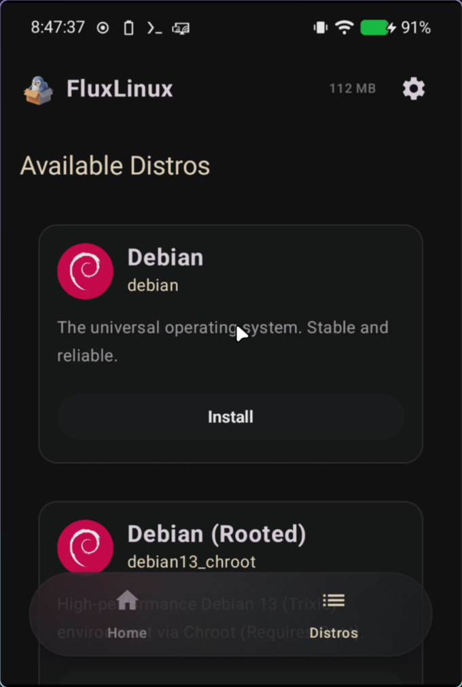
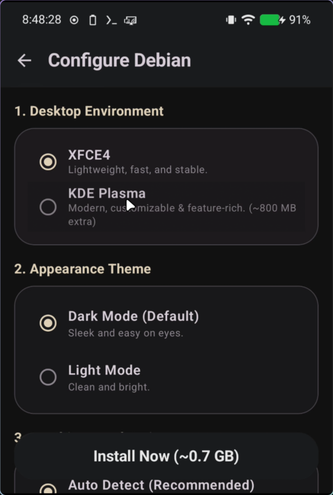
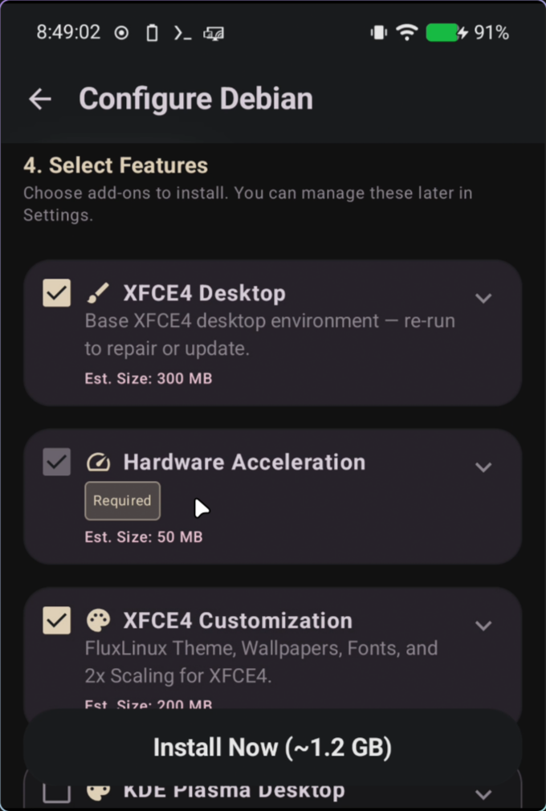
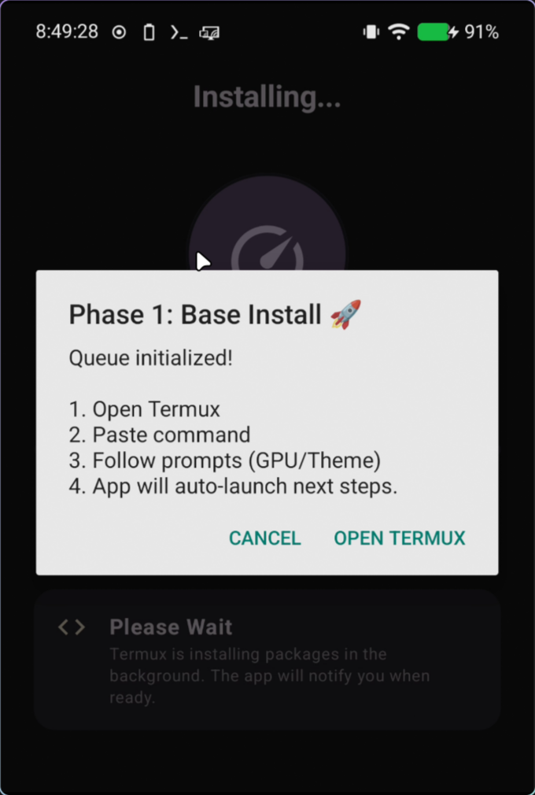
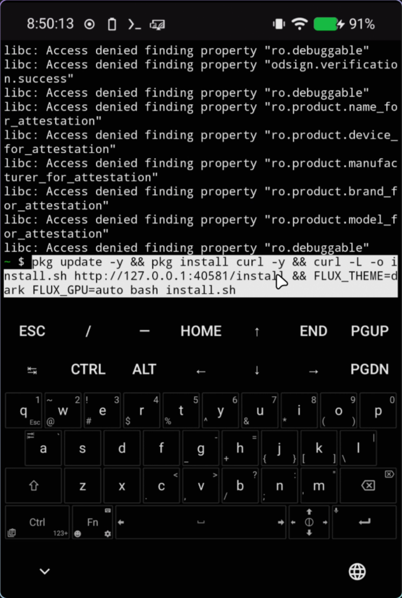

  
  <h1>🐧 Setting up Debian PRoot</h1>
  
This tutorial will guide you step-by-step through configuring and installing a Debian PRoot (non-rooted) distribution on your Android device using FluxLinux.

---

## 📖 Table of Contents

1. [🐧 Step 1: Select Debian Distribution](#-step-1-select-debian-distribution)
2. [⚙️ Step 2: Configure Debian Settings](#️-step-2-configure-debian-settings)
3. [📋 Step 3: Generate and Copy the Setup Command](#-step-3-generate-and-copy-the-setup-command)
4. [⚡ Step 4: Execute the Command in Termux](#-step-4-execute-the-command-in-termux)
5. [💡 Important Tips & Troubleshooting](#-important-tips--troubleshooting)

---

## 🐧 Step 1: Select Debian Distribution

Launch the FluxLinux app and navigate to the **Distributions** tab or page. Here you will see a list of available Linux distributions that you can install.

1. Select **Debian** from the list of distributions.
2. Tap on the Debian option to open its configuration and installation settings.

| Action / State | Screenshot | Description |
| :--- | :---: | :--- |
| **Select Debian** |  | Select **Debian** from the distributions list to configure its setup profile. |

---

## ⚙️ Step 2: Configure Debian Settings

Before generating the installation commands, you need to set up the container configuration profile to fit your device specifications.

1. **Select Mode:** Choose **PRoot** (this mode does not require root access and runs on any Android device).
2. **CPU Architecture:** Select your device architecture (typically `arm64` for modern devices).
3. **Desktop Environment:** Select **XFCE4** (recommended for a lightweight, feature-rich graphical interface).
4. **User Configurations:**
   - Define a custom **User Name** (e.g. `flux`).
   - Define a secure **Password** for the user account.
5. **Hardware Acceleration:** Configure GPU/hardware rendering:
   - Select **Turnip + Zink** for Adreno GPUs (modern 3D hardware acceleration).
   - Select **VirGL** or **None (Software rendering)** depending on your device capability.

| Action / State | Screenshot | Description |
| :--- | :---: | :--- |
| **Configure Distro (Part 1)** |  | Select **PRoot** mode, CPU architecture, and choose the desktop environment (XFCE4). |
| **Configure Distro (Part 2)** |  | Enter your username, password, select GPU Acceleration settings, and tap **Generate Setup Command**. |

---

## 📋 Step 3: Generate and Copy the Setup Command

Once you finish setting up your preferences, FluxLinux will compile a customized bootstrap script for Termux.

1. Tap on the **Generate Setup Command** button (if you haven't already).
2. Review the generated script and command options.
3. Tap **Copy and Open Termux**. FluxLinux will copy the bootstrap command to your device clipboard and automatically launch Termux.

| Action / State | Screenshot | Description |
| :--- | :---: | :--- |
| **Copy Setup Command** |  | Review the generated bootstrap script, then tap **Copy and Open Termux** to copy the command and launch Termux. |

---

## ⚡ Step 4: Execute the Command in Termux

Once Termux opens, you need to run the bootstrap command to download and compile the Debian container.

1. Long-press in the Termux terminal window and select **Paste** (or use the keyboard paste shortcut).
2. Press **Enter** on your keyboard to execute the bootstrap command.
3. Termux will now automatically download the Debian PRoot rootfs (root filesystem), extract it, configure system packages, and initialize your XFCE4 desktop.
4. Once completed, your Debian desktop environment will start and open automatically via the Termux:X11 display.

| Action / State | Screenshot | Description |
| :--- | :---: | :--- |
| **Execute Command** |  | Paste the copied bootstrap command in the Termux terminal and press enter to start the automated installation. |

---

## 💡 Important Tips & Troubleshooting

### 🔄 Keep Termux Running in the Background
Since the Debian distribution runs as a sub-process inside Termux, you must **never** close Termux from your recent apps. If Termux is terminated, your Debian desktop session will crash immediately.

### ⚡ PRoot vs Chroot Mode
* **PRoot Mode:** Used in this guide. It runs entirely in user-space, requires **no root permissions**, and intercepts system calls to simulate root actions.
* **Chroot Mode:** Requires root permissions. It provides near-native performance and full hardware access but requires your Android device to be rooted.

### 🏎️ Troubleshooting Hardware Acceleration (GPU)
* If your graphical environment crashes or has display artifacts:
  1. Try disabling Hardware Acceleration (set it to **None / Software Rendering**) in the distro configuration page.
  2. If you have a Snapdragon device with an Adreno GPU, ensure that your device supports **Turnip + Zink** for optimal Vulkan/OpenGL performance.
